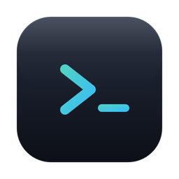
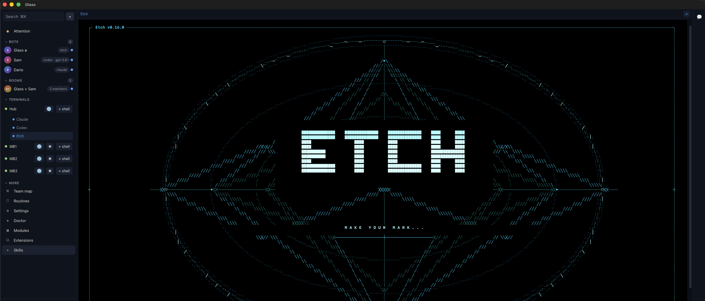

<h1 align="center">
  
   Glass
</h1>

  <b>Your terminals and AI assistants, on every device you own.</b>
   
  Start something on your Mac. Close the lid. Pick it up on your phone, still running.

  
  
  

  <a href="../../releases/latest">Download</a> ·
  <a href="#why-glass">Why</a> ·
  <a href="#what-you-can-do">Features</a> ·
  <a href="#is-it-for-you">Is it for you?</a> ·
  <a href="#questions">FAQ</a>

  

---

## Why Glass

- **Your work never stops.** Close the app, update it, let the laptop die. It keeps running, and it's all still there.
- **Updates can't break you.** The new version boots beside the old one and has to prove it works. If it doesn't, nothing changed.
- **Nobody in the middle.** The server between your machines is a dumb pipe with no key to anything. Take it over and your devices still refuse it.
- **No passwords to steal.** Every device gets its own identity. Adding one is a six-digit code, like pairing headphones.
- **Broken on purpose first.** 71 tests try to destroy every release before it ships: killing tasks mid-run, faking identities, corrupting backups.

## What you can do

- **See every machine at once.** All your computers, everything running on them, from any screen. A colored dot says what's working and what's waiting on you.
- **Put AI assistants to work and walk away.** Several at a time, across machines, still going with the app closed. Everything needing your decision lands in one inbox.
- **Give them a team.** Each assistant gets a machine, a folder, a memory, a personality. Put a few in a room and they hand work to each other, with your say-so.
- **Let one drive the computer.** Mouse, keyboard, and screen, only with your permission, while you watch and can take over instantly.
- **Keep secrets safe.** A locked vault for the keys your machines need, with a printed recovery code. One encrypted backup restores everything onto a new machine.
- **Browse from another computer.** Pages load on the laptop in front of you but reach the internet from the machine at home.
- **Host your own code privately.** Your machine, your projects, your other devices. No third party.

## Mac and phone

The phone app is for talking to your assistants. Everything hands-on stays on the Mac.

| | Mac | Phone |
| :-- | :--: | :--: |
| Chat with your assistants | ✅ | ✅ |
| Rooms and approvals | ✅ | ✅ |
| Terminals | ✅ | — |
| Let an assistant drive the computer | ✅ | — |
| Watch a machine's screen | ✅ | — |
| Browse from another computer | ✅ | — |

## Is it for you?

**Yes, if** you own a few computers, live in a terminal, and want your own setup
instead of a subscription to someone else's.

**No, if** you want something that works the second you sign up. There's no
signup. You run this yourself, and one of your machines becomes the hub the
others connect through. That's the deal, and it's why nobody else can read your
data.

**Today it's Apple Silicon Macs.** Linux is built and tested but not yet released.

## Questions

**Do I need to be a programmer?** Realistically, yes. Glass is for people who
work in a terminal and use AI coding assistants.

**Where does my data go?** Your own computers, and nowhere else. The server in
the middle only sees scrambled data it can't unlock.

**What does it cost?** Nothing for personal use. You only pay for the cheap
middle server if you want to reach your machines from outside your home.

**Can I use my own AI tools?** Yes. Etch, Codex, and Claude work out of the box,
and other command-line assistants can be added.

**Is the code public?** No. Glass is private software. The app you download is
covered by the license here.

## License

Glass is proprietary. [LICENSE](LICENSE) covers the app you download: use it
yourself, personally and non-commercially, and don't redistribute, resell,
modify, or take it apart.

This repository holds the downloads, the license, and the notices for other
people's software included in the app. The source is developed privately.

Third-party components keep their own licenses, reproduced in full in
[THIRD_PARTY_NOTICES.md](THIRD_PARTY_NOTICES.md).
